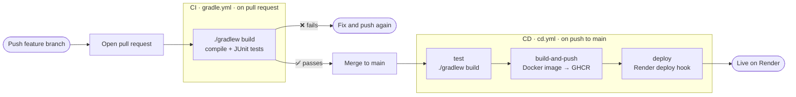

# CI/CD pipeline

Two GitHub Actions workflows: one checks code **before** it's merged, and one ships it **after**.

## CI: `gradle.yml`

- **When:** every pull request to `main`.
- **What:** compiles the code and runs the JUnit tests.
- **Why:** you see ✅ or ❌ on the PR before anything is merged. To *block* merging on ❌, add a branch protection rule: **Settings → Branches → require status checks**.

## CD: `cd.yml`

- **When:** every push to `main`, which includes merged PRs.
- **What:** three jobs, each waiting for the previous one (`needs:`):
  1. **test:** runs the tests again on the merged code. It may differ from the PR if other PRs were merged in between.
  2. **build-and-push:** builds the Docker image and pushes it to GitHub Container Registry, tagged `:latest` and `:sha-<commit>`.
  3. **deploy:** calls Render's deploy hook with the exact `:sha-<commit>` image.
- **If any job fails, the jobs after it don't run.** Untested code is never deployed.

## Where things live

| What | Where |
|---|---|
| Workflows | `.github/workflows/gradle.yml`, `.github/workflows/cd.yml` |
| Images | GitHub → Packages → `zombieapocolypsejavaedition` |
| Runs and logs | GitHub → Actions tab |
| Running app | Render dashboard → `zombie-api` |
