# Class Diagram

The domain model in `no.loopacademy.models`. `UserProfile`, `AuditEntry` and `AuditAction` are **proposed** and not in the code yet, and so are `Survivor.owner` and `Survivor.isOwnedBy()`. Getters, setters, `equals` and `hashCode` are left out.

```mermaid
---
config:
  theme: neutral
  layout: elk
  look: classic
---
classDiagram
    direction TB

    %% ---------- External: Keycloak ----------
    class user_entity {
        <<Keycloak table>>
        -String id
        -String username
        -String email
        -String email_constraint
        -boolean email_verified
        -boolean enabled
        -String first_name
        -String last_name
        -String realm_id
        -Long created_timestamp
        -String federation_link
        -String service_account_client_link
        -int not_before
    }
    note for user_entity "External: lives in the keycloak database.<br>Managed by Keycloak, never written by our code."

    %% ---------- Proposed ----------
    class UserProfile {
        <<Entity>>
        -Long id
        -String keycloakId
        -String displayName
        -Instant createdAt
    }
    note for UserProfile "Proposed. keycloakId = the JWT 'sub' claim (unique).<br>Keycloak owns login; we only store the game profile."

    class AuditEntry {
        <<Entity>>
        -Long id
        -UserProfile actor
        -AuditAction action
        -String entityType
        -Long entityId
        -String details
        -Instant timestamp
    }
    note for AuditEntry "Proposed. Append-only: created once, never updated."

    class AuditAction {
        <<enum>>
        SURVIVOR_CREATED
        SKILL_ADDED
        SKILL_REMOVED
        ITEM_LOADED
        ACTION_PERFORMED
    }

    %% ---------- Survivors ----------
    class Survivor {
        <<Entity>>
        -Long id
        -String name
        -List~Skill~ skills
        -List~Item~ gear
        -SurvivorAttributes attributes
        -SurvivorType type
        -UserProfile owner
        +load(Item item) void
        +performAction(Action action) double
        +isOwnedBy(UserProfile user) boolean
        -getMaxLoad() double
    }

    class SurvivorType {
        <<enum>>
        CAREGIVER
        HERO
        OUTLAW
        TESTSURVIVOR
        -SurvivorAttributes defaultAttributes
        -List~Skill~ defaultSkills
        +getDefaultAttributes() SurvivorAttributes
        +getDefaultSkills() List~Skill~
    }

    class Skill {
        <<enum>>
        Marksman
        FieldMedicine
        Cooking
        40 values in total
    }

    %% ---------- Attributes ----------
    class GeneralAttributes {
        <<MappedSuperclass>>
        -double strength
        -double endurance
        -double agility
        -double courage
        -double intelligence
        -double leadership
        -double trustworthiness
        +add(GeneralAttributes other) GeneralAttributes
    }
    class SurvivorAttributes {
        <<Embeddable>>
    }
    class AttributeWeights {
        <<Embeddable>>
    }

    %% ---------- Items ----------
    class Item {
        <<Entity>>
        -Long id
        -String name
        -double weight
        -Survivor survivor
    }
    class Weapon {
        <<Entity>>
        -int damage
    }
    class Tool {
        <<Entity>>
        -int durability
    }
    class WeaponCategory {
        <<enum>>
        FireArm
        Bow
        Thrown
        Blunt
        Edged
        Improvised
        Explosive
    }

    %% ---------- Actions ----------
    class Action {
        <<Entity>>
        -Long id
        -String name
        -ActionType type
        -String effect
        -String target
        -AttributeWeights attributeWeights
    }
    class ActionType {
        <<enum>>
        Attack
        Heal
        Fix
        13 values in total
    }
    class ActionResult {
        <<record>>
        Survivor survivor
        Action action
        double score
    }

    %% ---------- Relationships ----------
    UserProfile "0..1" ..> "1" user_entity : keycloakId = id (JWT sub)
    UserProfile "1" -- "0..1" Survivor : owns
    AuditEntry "*" --> "1" UserProfile : actor
    AuditEntry --> AuditAction

    Survivor *-- "1" SurvivorAttributes : attributes
    Survivor "1" -- "*" Item : gear
    Survivor --> "*" Skill : skills
    Survivor --> "1" SurvivorType : type
    Survivor ..> Action : performs
    SurvivorType ..> SurvivorAttributes : creates defaults
    SurvivorType --> "*" Skill : default skills

    GeneralAttributes <|-- SurvivorAttributes
    GeneralAttributes <|-- AttributeWeights

    Item <|-- Weapon
    Item <|-- Tool

    Action *-- "1" AttributeWeights : weights
    Action --> "1" ActionType : type
    ActionResult --> Survivor
    ActionResult --> Action

    %% ---------- Styling ----------
    %% entity
    style Survivor fill:#dbeafe,stroke:#1d4ed8,stroke-width:2px,color:#0f172a
    style Item fill:#dbeafe,stroke:#1d4ed8,stroke-width:2px,color:#0f172a
    style Weapon fill:#dbeafe,stroke:#1d4ed8,stroke-width:2px,color:#0f172a
    style Tool fill:#dbeafe,stroke:#1d4ed8,stroke-width:2px,color:#0f172a
    style Action fill:#dbeafe,stroke:#1d4ed8,stroke-width:2px,color:#0f172a
    %% value
    style GeneralAttributes fill:#dcfce7,stroke:#15803d,stroke-width:1.5px,color:#0f172a
    style SurvivorAttributes fill:#dcfce7,stroke:#15803d,stroke-width:1.5px,color:#0f172a
    style AttributeWeights fill:#dcfce7,stroke:#15803d,stroke-width:1.5px,color:#0f172a
    style ActionResult fill:#dcfce7,stroke:#15803d,stroke-width:1.5px,color:#0f172a
    %% enum
    style SurvivorType fill:#fef3c7,stroke:#b45309,stroke-width:1.5px,color:#0f172a
    style Skill fill:#fef3c7,stroke:#b45309,stroke-width:1.5px,color:#0f172a
    style ActionType fill:#fef3c7,stroke:#b45309,stroke-width:1.5px,color:#0f172a
    style WeaponCategory fill:#fef3c7,stroke:#b45309,stroke-width:1.5px,color:#0f172a
    %% proposed
    style UserProfile fill:#fce7f3,stroke:#be185d,stroke-width:2px,stroke-dasharray:6 4,color:#0f172a
    style AuditEntry fill:#fce7f3,stroke:#be185d,stroke-width:2px,stroke-dasharray:6 4,color:#0f172a
    style AuditAction fill:#fce7f3,stroke:#be185d,stroke-width:2px,stroke-dasharray:6 4,color:#0f172a
    %% external
    style user_entity fill:#e2e8f0,stroke:#475569,stroke-width:2px,color:#0f172a
```

## Colour key

| Colour | Meaning |
|---|---|
| Blue | Entity: has its own table |
| Green | Value type: embedded in an entity's table, or a plain record |
| Yellow | Enum: stored as text in a column |
| Pink, dashed border | Proposed: not in the code yet |
| Grey | External: Keycloak's table, not ours |

## Reading the arrows

| Arrow | Meaning | Example |
|---|---|---|
| `<\|--` | Inheritance ("is a") | `Weapon` is an `Item` |
| `*--` | Composition: embedded, can't exist on its own | `SurvivorAttributes` columns live in the `survivor` table |
| `--` / `-->` | Association: a reference to another object | A `Survivor` carries `Item`s |
| `..>` | Dependency: uses it, doesn't store it | `performAction(Action)` |

## Notes on the proposed classes

**UserProfile** is the `Player` from the backlog. Keycloak owns the login, and we store only what the game needs, linked by `keycloakId` (the token's `sub` claim). It's created on the first authenticated request, so there's no register endpoint. Each profile owns at most one survivor. The foreign key lives on `Survivor` (`owner`), so `isOwnedBy()` can compare owners without a database call.

**The link to Keycloak (`user_entity`)** is a dashed line, not a foreign key. Keycloak keeps its users in its own `keycloak` database, and Postgres can't enforce a foreign key across databases. The link is by value: every token's `sub` claim holds the user's `user_entity.id`, and we store that as `UserProfile.keycloakId`. Our code only ever reads the token. It never queries or writes Keycloak's tables, because their layout can change between Keycloak versions. If you need a user's email or name, read it from the token's claims.

**AuditEntry** records who did what. Two deliberate choices:
- **`entityType` + `entityId`, not a foreign key.** One audit table can then point at any kind of entity, and entries survive if that entity is deleted later. That's the point of an audit log.
- **Append-only.** Entries are created by the service layer after a successful change, and are never edited. So the entity needs no setters.

## Things the diagram shows up

- **`WeaponCategory` isn't used.** `Weapon` has no category field yet, so the enum isn't connected to anything.
- **`TESTSURVIVOR`** is test data in a production enum. Once survivors are saved to the database, it's a real value players could pick.
